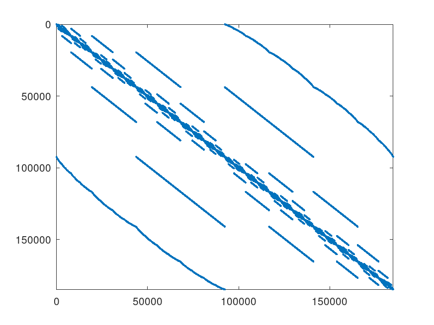
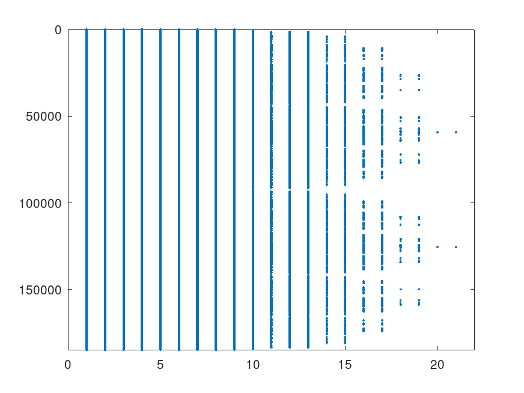

# PELS: Performance Engineering for (sparse) Linear Solvers Demo

(Intro/overview)

## Computational backends and performance reporting

- There are both CPU and GPU implementations, using ``numba`` and ``numba.cuda``, respectively.
  The drivers will detect if there is a GPU available and switch to using it automatically.
- Use the ``-c_kernels`` flag to the driver routine to use C/OpenMP implementations of
  basic operations. The rules to comple the kernels are defined in ``Makefile``. By default,
  GCC is used, if you want to use another compiler, adapt it accordingly.


# Setup

The Python code in this repository requires only standard libraries like numpy, numba and scipy.
To make sure they are available, you can use the following command:

```bash
pip install -r requirements.txt
```
## Optional requirements

In order to use an NVidia GPU, you also need cuda.
For using the C backend (in particular in combination with RACE, see below), you need a C compiler
like GCC or Intel.

## Testing the installation

The command ``pytest`` will execute a few simple tests. If a GPU and cuda are available, they will be run on the GPU.
In that case, please ignore warnings about under-utilization of the device.
To specifically test the C backend, use ``pytest -c_kernels``.

# Example usage

# Example 1: Sparse Matrix Formats on the GPU

On a node with an Nvidia A100 GPU, we compute the smallest eigenvalue (ground state energy) of a spin-chain matrix:

```bash
$ python3 lanczos.py -matfile spinSZ26.mm.gz
```

Which may result in output like this:

```bash
Smallest eigenvalue computed: -4.621450e+01
Hardware: NVIDIA A100 80GB PCIe
kernel	calls	bw_meas	bw_roofline	t_meas/call	t_roofline/call

dot	79	649.365 GB/s	1560 GB/s	0.000256265 s 	0.000106673 s 
axpby	118	942.743 GB/s	1690 GB/s	0.000264774 s 	0.000147701 s 
spmv	39	347.224 GB/s	1690 GB/s	0.00593799 s 	0.00122001 s 
Total	 	 	 	 	 	 0.28307 s 	 0.0734362 s
```

This matrix is irregular with about 10M rows and 1-27 nonzeros per row.
A smaller variant, SpinSZ22 is shown below:

SpinSZ22 sparsity pattern | SpinSZ22 compressed view                 
--------------------------|---------------------------------------------
 |  |

Better SpMV performance on the GPU can be achieved by using the SELL-C-sigma format:

```bash
$ python3 lanczos.py -matfile spinSZ26.mm.gz -fmt SELL -C 128 -sigma 1024
[...]
Hardware: NVIDIA A100 80GB PCIe
kernel	calls	bw_meas	bw_roofline	t_meas/call	t_roofline/call

dot	77	784.946 GB/s	1560 GB/s	0.000212001 s 	0.000106673 s 
axpby	115	979.641 GB/s	1690 GB/s	0.000254802 s 	0.000147701 s 
spmv	38	1257.82 GB/s	1690 GB/s	0.0016392 s 	0.00122001 s 
Total	 	 	 	 	 	 0.107916 s 	 0.0715597 s
```

For the larger and very regular 5-point Laplace matrix with 25M rows and columns, the CSR format works just fine,
and kernel launch latency has less impact, so that the performance of all kernels is quite good:
```bash
$ python lanczos.py --matgen Laplace5000x5000 -tol 1e-3
[...]
Smallest eigenvalue computed: 1.636828e-06
Hardware: NVIDIA A100 80GB PCIe
kernel	calls	bw_meas	bw_roofline	t_meas/call	t_roofline/call

dot	1657	1063.91 GB/s	1560 GB/s	0.000375972 s 	0.00025641 s 
axpby	2485	1286.08 GB/s	1690 GB/s	0.000466534 s 	0.00035503 s 
spmv	828	1217.81 GB/s	1690 GB/s	0.00172421 s 	0.00124246 s 
Total	 	 	 	 	 	 3.20997 s 	 2.33588 s
```

# Example 2: CG solver on the CPU

The hardware used is a node with 2 32-core Intel Sapphire Rapids CPU's and sub-NUMA clustering, giving four NUMA domains with
16 cores each. We start by setting some environment variables to disable using the GPUs (if any) and using the OpenMP backend 
of Numba:
````bash
export NUMBA_THREADING_LAYER=omp
export CUDA_VISIBLE_DEVICES=""
```

Depending on your system, you may want to manually pin threads to cores, e.g., to run on all 16 threads of one NUMA domain:

```bash
export LAUNCH="likwid-pin -C E:M0:0-15"
export NUMBA_NUM_THREADS=16
```

## Plain CG method 

To solve a linear system with the Laplace operator above:

```bash
${LAUNCH} python3 pcg.py -matgen Laplace5000x5000 -tol 1e-3
```
